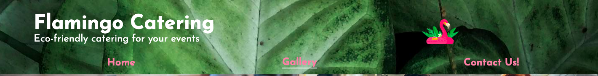
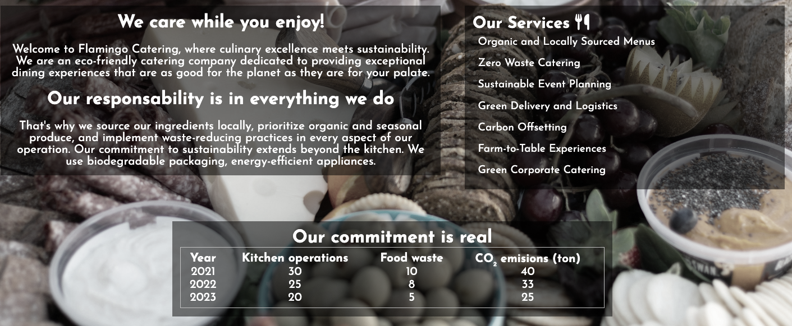
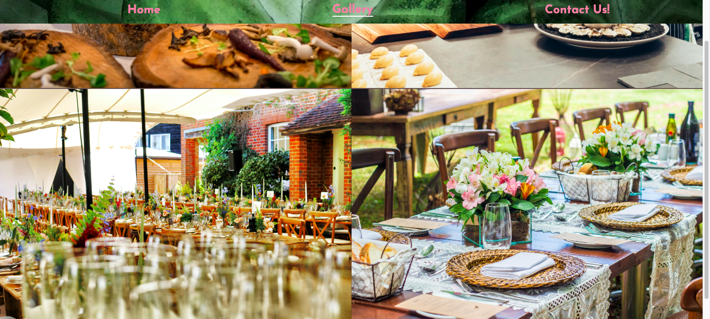
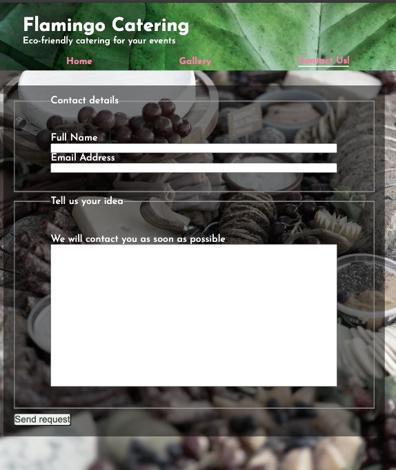
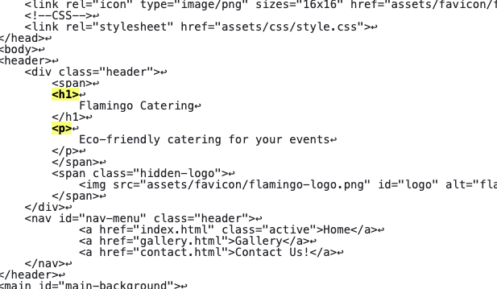
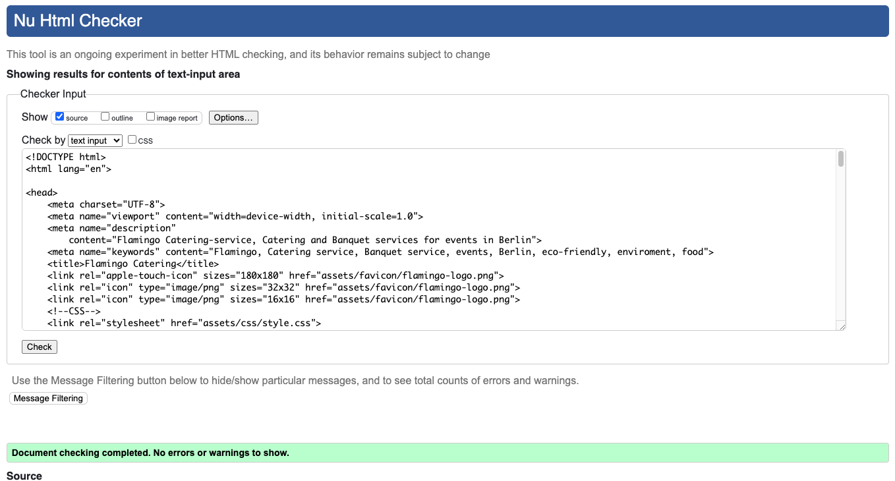
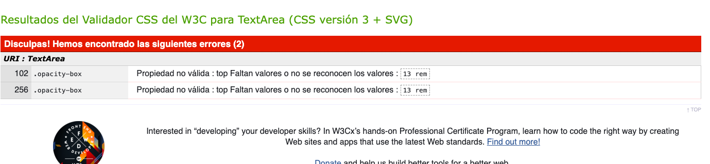
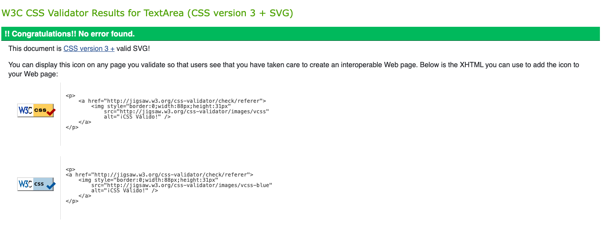

# Flamingo Catering

We live in an era in wich the enviroment should be one of our main concerns, and catering and event managment is not the exception. Normaly, because of the enormous work that means 
developing an event, the eco-friendly aspect is not fully considered. In fact, most of the times is ignored. In Flamingo Catering we offer more than a incredible culinary experience,
our MAIN concern is the enviroment and we are constanly looking for ways to improve our impact to it. We are the option for big companys and small privates to be able to still enjoy
from a good celebration without the concern of how is this affecting our world around.

In the site you could find our services, a gallery with fotos of our latest events, the option to see in real time the impact of the company, links to our social-media networks and 
a form page where the client can contact the catering with concerns and event ideas. The main target are green based companys that look for an event planner who can mantain 
their eco-friendly aproach.

## Features

### Header/Navigation

- The Header is fixed to the Nav-bar at the top of the page. It shows the name of the business at the left with a subtitle that explains the main purpose of it and on the right the logo that is also in the favicon element.

- The navigation has 3 main elements: Home, Gallery and Contact Us! Each one directs to a different page. Under every element there is a underline who shows in which page you are on.

- The contrast with the leaf background and the pink tones of the logo and the letters shows the "natural" aspect of the business. 

### Home

- Here the costumer can find the main aspects of the business with an introduction and a small explanation of the service.

- To the right are all the services that are offered.

- At the bottom the is a table that shows relevant information related to the main objetives of the company that shows the commitment to the costumers.

- The only food image at this page is the background that repeats in every page, this shows that the core aspect is the first consideration and the catering explains by itselfs.

### Gallery

- The gallery shows with vivid images the profesionalism that is espected in a service like this.

- The images are shown at full display and are explained with alt atributes.

### Sign Up!

- The form section is easy to acces and to fill. It invites the potential costumer to start the contact as soon as possible with an request.

### Footer

- The footer is always at the bottom of the page and gives access to all the social media related to the company. Where you should be able to find the newest event.

- All links open in a new tab an have logos to make the recognition easyer.

### Testing

- I tested this page in the main browsers (Chrome, Opera and Safari) and in mobil devices, it shows good reaction to different screen sizes.

- The navigation and links are fully functional.

- I confirmed that the form page is responsive and post the information succesfully.

### Validation

#### HTML

- I tested all 3 pages of html in the validator and besides some syntax errors that were easly solved it passed all of them.

- By changing the span element to a div one it solved the error

#### CSS

 - I tested the CSS code in the validator and passed correctly after solving syntax errors.

 
 

 ### Solve problems

 During the pages creation i had a problem because of the size of the background an its position wich didn`t allowed scrolling down and the footer didn't stayed at the bottom

 I contacted student

