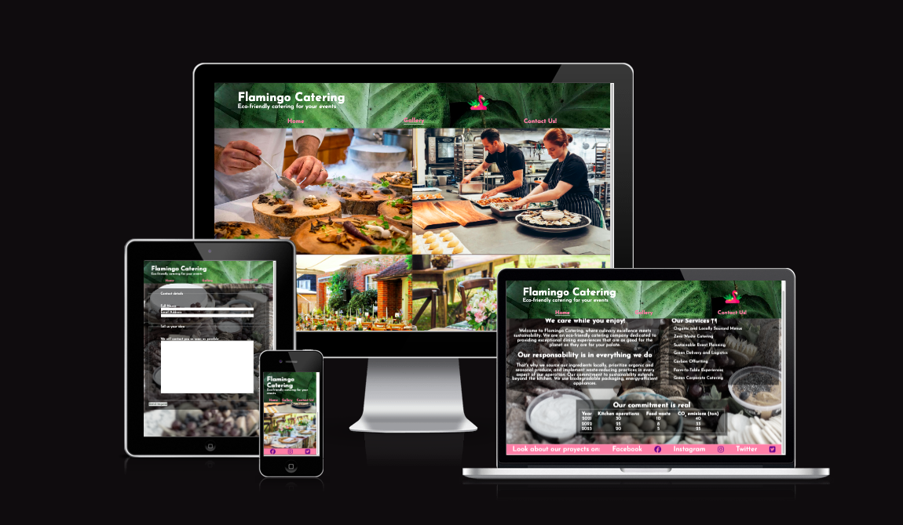

# Flamingo Catering

We live in an era in wich the enviroment should be one of our main concerns, and catering and event managment is not the exception. Normaly, because of the enormous work that means 
developing an event, the eco-friendly aspect is not fully considered. In fact, most of the times is ignored. In Flamingo Catering we offer more than a incredible culinary experience,
our MAIN concern is the enviroment and we are constanly looking for ways to improve our impact to it. We are the option for big companys and small privates to be able to still enjoy
from a good celebration without the concern of how is this affecting our world around.

In the site you could find our services, a gallery with fotos of our latest events, the option to see in real time the impact of the company, links to our social-media networks and 
a form page where the client can contact the catering with concerns and event ideas. The main target are green based companys that look for an event planner who can mantain 
their eco-friendly aproach.

